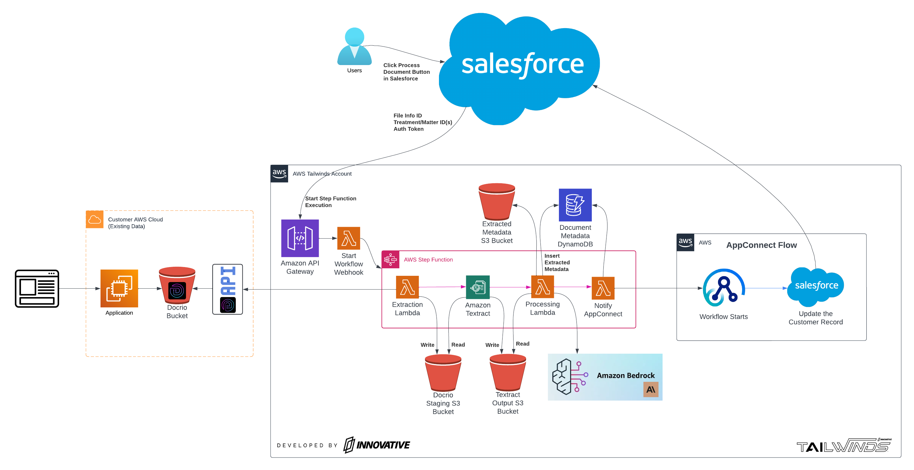
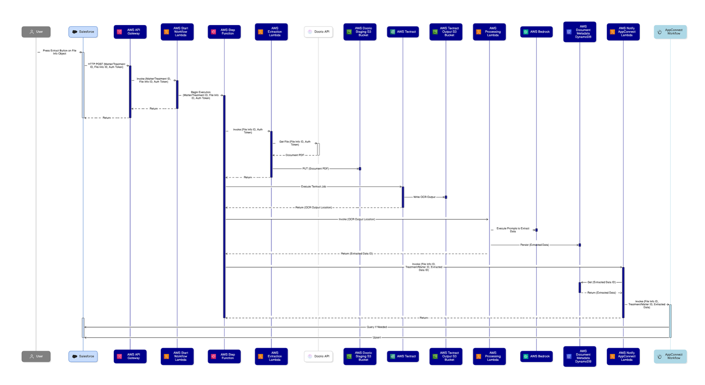

# Project Overview

This project implements an automated document processing workflow using AWS services and integrates with Salesforce and IBM AppConnect. The system processes medical documents, extracts relevant information, and updates the corresponding records in Salesforce.

## Architecture Overview

<details>
<summary>Infrastructure (click to expand)</summary>




- AWS S3 Buckets:
   - sh-raw-staging: This bucket hosts documents that have been extracted
   - sh-textract-output: This bucket stores the texract output for each document that is processed.
   - sh-lambda-output: This bucket stores the generated metadata JSON files of documents that are successfully processed.

- API Gateway: Retrieves file info ID, treatment matter ID, and authentification token. Used to trigger the step function execution.

- DynamoDB: The sh-Document-Metadata-Table stores document metadata after documents have been successfully processed. Records are sorted by their processing timestamp while the table is partioned by documentId.

- Lambda Functions:
   - Start Workflow WebHook: Responsible for initiating the document processing workflow by starting a Step Function execution.
   - Extraction Lambda: Responsible for interfacing with the DocRio API to extract documents and upload them to the raw staging bucket.
   - Processing Lambda: Responsible for analyzing and organizing the provided Textract output. Writes the organized metadata to the sh-lambda-output S3 bucket and the sh-Document-Metadata-Table (Dynamo DB).
   - Notify App Connect Lambda: Responsible for making final processing update to the Dynamo DB table and providing App Connect with the required IDs to update the record in Salesforce.

</details>

<details>
<summary>Workflow (click to expand)</summary>




- The document processing workflow is initiated from Salesforce via the Process Document button.

- This button triggers an HTTP POST request to the AWS API Gateway.
   - This request emcompasses:
      - the document_id
      - file_info_id
      - document_type
      - DocRio authentification token

- The API Gateway triggers the Start Workflow Lambda function. This function receives the payload from the API Gateway and initiates the Step Function workflow.

- The Step Function orchestrates the document processing by:
   - Retrieving the document from DocRio (using the Extraction Lambda function).
   - Extracting text interfacing with Amazon Textract directly.
   - Analyzing and organizing the Textract content using Amazon Bedrock and storing the results in DynamoDB and S3.
   - Notifying IBM AppConnect with the required parameters, allowing the Salesforce record to be updated.
   - NEW 💥 each step in the workflow updates the Salesforce record with the current Document Extraction Status.

</details>

## Prerequisites

Before you begin, ensure you have the following installed and configured:

1. Python 3.8 or later
2. Poetry (for Python dependency management)
3. Node.js (version 18.x or later)
4. AWS CLI configured with appropriate credentials
5. AWS CDK CLI installed (`npm install -g aws-cdk`)
6. For Windows users:
   - We recommend using Windows Subsystem for Linux (WSL) for a smoother experience
   - Follow the [WSL installation guide](https://docs.microsoft.com/en-us/windows/wsl/install) to set it up
   - If not using WSL, ensure you have Windows versions of all prerequisites installed

## Build and Deploy Instructions:

1. Clone the Github repository:
   ```
   git clone <repository-url>
   cd <project-directory>
   ```

2. Install dependencies:
   ```
   poetry install
   ```

3. Set up the environment variables:
   - Copy the contents of `example.env` to a new `.env` file:
     ```
     cp example.env .env
     ```
   - Open the `.env` file and update the values as needed for your environment.

4. Use the provided Makefile commands for common operations (Linux/macOS):
   - Build the project: `make build`
   - Deploy the stack: `make deploy`
   - Synthesize CloudFormation template: `make synth`
   - Run tests: `make test`
   - For more commands, run: `make help`

   For Windows users, use the PowerShell script (`build.ps1`):
   - Open PowerShell and navigate to the project directory
   - Build the project: `.\build.ps1 build`
   - Deploy the stack: `.\build.ps1 deploy`
   - Synthesize CloudFormation template: `.\build.ps1 synth`
   - Run tests: `.\build.ps1 test`
   - For more commands, run: `.\build.ps1 help`

   Note: Make sure to run PowerShell as an administrator if you encounter permission issues.

## Project Structure

- `lib/`: Contains the main stack definition and constructs (TypeScript)
- `bin/`: Entry point for the CDK application (TypeScript)
- `lambda/`: Contains Lambda function code (Python)
- `src/`: Contains shared Python source code used by Lambda functions
- `scripts/`: Contains documentation and SAM configuration
- `cdk.json`: CDK configuration file
- `tsconfig.json`: TypeScript configuration
- `pyproject.toml`: Poetry configuration file
- `Makefile`: Automation for common commands (Linux/macOS)
- `build.ps1`: PowerShell script for automation (Windows)
- `example.env`: Example environment variable file
- `README.md`: Project documentation

## Technology Stack

- AWS CDK: Infrastructure as Code (written in TypeScript)
- Lambda Functions: Python
- Build Automation: Makefile and Poetry

## Available Commands

Use the provided Makefile to run common commands. For a full list of available commands, run:

```
make help
```

## Manual Processing and Testing

For instructions on how to manually process and test documents, please refer to the [MANUAL-PROCESSING.md](./scripts/MANUAL-PROCESSING.md) file.

## Troubleshooting

For troubleshooting information, please refer to the [TROUBLESHOOTING.md](./assets/TROUBLESHOOTING.md) file.

## Useful Resources

- [AWS CDK Best Practices with TypeScript](https://docs.aws.amazon.com/cdk/v2/guide/best-practices.html)
- [Python Best Practices for AWS Lambda](https://docs.aws.amazon.com/lambda/latest/dg/best-practices.html)
- [AWS CDK Documentation](https://docs.aws.amazon.com/cdk/v2/guide/home.html)
- [TypeScript Documentation](https://www.typescriptlang.org/docs/)
- [Poetry Documentation](https://python-poetry.org/docs/)
- [Install Linux on Windows with WSL](https://docs.microsoft.com/en-us/windows/wsl/install)


## License

This project is licensed under the MIT License - see the LICENSE file for details.
