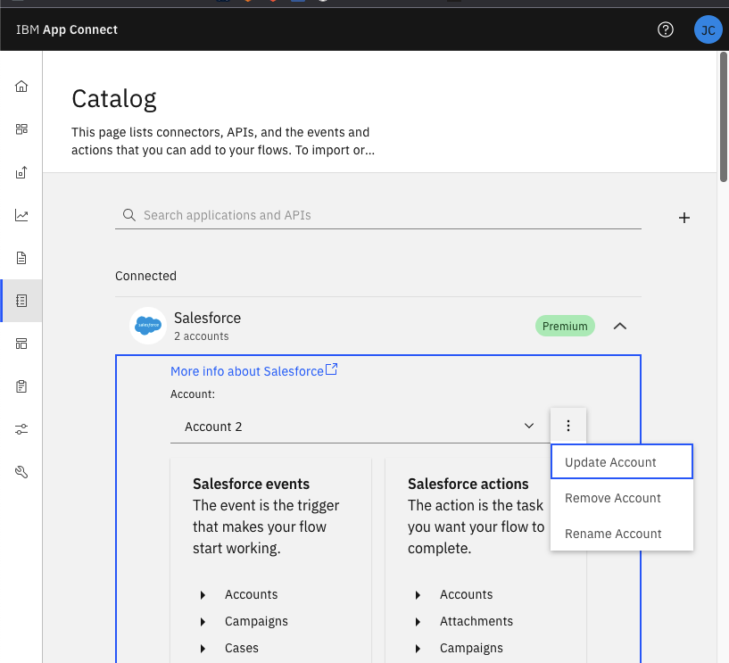
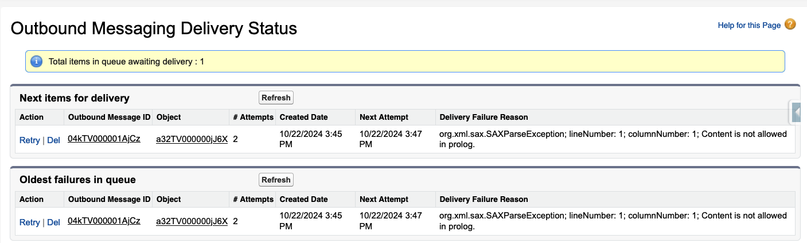

Certainly! I'll provide you with the content to copy/paste into your TROUBLESHOOTING.md file. I'll reference the code blocks using the start and end line numbers as requested. Here's the content:

# Troubleshooting Guide: IBM App Connect SaaS with Salesforce API Flows

## Scenario: Process Records (GenAI) Button Not Updating Treatment Fields

When you click the "Process Records (GenAI)" button in a Salesforce Treatment Record and don't see any changes or updates to the treatment fields after a few minutes, consider the following troubleshooting steps:

### 1. Token Expiration or Timeout

<details>
<summary>Token Expiration or Timeout Screenshot (Click to Expand)</summary>

 
</details>

You will see a message response in the Step Function output log like the following:

```
{"message": "The action was rejected by Salesforce.",
  "data": {
    "errorDetail": "{\"name\":\"invalid_client_id\",\"errorCode\":\"INVALID_ERROR\"}"
  }
``` 

If the token has expired or timed out, follow these steps:

1. Log into your IBM App Connect account.
2. Click on the "Catalog" icon.
3. Select your Salesforce Connected App.
4. Click "Update Account".
5. When prompted, enter the URL: `login.salesforce.com`
6. Enter the aws-litify service account credentials when prompted.
7. Click "Allow Changes" to grant the necessary permissions for updating and writing information to Salesforce.

### 2. LLM Misunderstanding or Incorrect Field Extraction

If the Large Language Model (LLM) is not extracting fields correctly, follow these steps:

1. Check the CloudWatch logs for the processing lambda function. The relevant code can be found here:


```195:275:lambda/processing/handler.py
def process_data_with_claude(combined_text: str, src_key: str, document_type: str) -> Dict[str, Any]:
    system_prompt = """You are a medical document processor trained in extracting information from medical documents. Use the provided Textract OCR results to extract the data accurately and concisely."""

    document_prompts = {
            "PT/Chiro": """Extract the following information:
- history: The patients account of what they verbally told the provider. Reason for visit, history of present illness, cause of injury (Limit to 1-2 sentences). If they are bulleted or numbered, please keep them numbered in the response. (e.g "history": ["1. He is complaining of low back pain. ", "2. He is also complaining of neck pain."]) {"value": array of strings}
- chiefComplaints: What the client complained about in regards to their injury (Limit to 1-2 sentences). If they are bulleted or numbered, please keep them numbered in the response. {"value": string}
- numberOfVisits: Total count of visits to the provider. {"value": number}
- impression: The provider's diagnosis and interpretation of the patient's condition based on their exam or diagnostic test (Limit to 1-2 sentences). If they are bulleted or numbered, please keep them numbered in the response. (e.g "impression": []"1. The patient has a fracture of the left leg", "2. The patient has a fracture of the right leg"],) {"value": array of strings}
- recommendations: Recommendations based on treatment. If applicable, select ONE of the available values: Physical Therapy, Diagnostic Testing, Injections, Surgery {"value": string}""",
            "Provider": """Extract the following information:
- history: The patients account of what they verbally told the provider. Reason for visit, history of present illness, cause of injury (Limit to 1-2 sentences). If they are bulleted or numbered, please keep them numbered in the response. (e.g "history": ["1. He is complaining of low back pain. ", "2. He is also complaining of neck pain."]) {"value": array of strings}
- chiefComplaints: What the client complained about in regards to their injury (Limit to 1-2 sentences). If they are bulleted or numbered, please keep them numbered in the response. {"value": string}
- numberOfVisits: Total count of visits to the provider. The default value is 0. {"value": number}
- examFindings: The physical exam findings throughout the chronology of the visits. Summary based on current physical exam and the clients condition (Limit to 4-6 sentences) {"value": string}
- impression: The provider's diagnosis and interpretation of the patient's condition based on their exam or diagnostic test (Limit to 1-2 sentences). If they are bulleted or numbered, please keep them numbered in the response. (e.g "impression": ["1. The patient has a fracture of the left leg", "2. The patient has a fracture of the right leg"],) {"value": array of strings}
- recommendations: Recommendations based on treatment. If applicable, select ONE of the available values: Physical Therapy, Diagnostic Testing, Injections, Surgery. {"value": string}
- surgeryRecommended: If surgery is recommended next course of treatment then true else false. The default value is false. {"value": boolean}
- injectionRecommended: If injections are recommended next course of treatment then true else false. The default value is false. {"value": boolean}
- positiveFindings: If a positive finding of fractures, bulges, herniations,or tears exist then true else false. The default value is false. {"value": boolean}
- numberofFractures: Count of unique fractures in findings. The default value is 0. {"value": number}
- numberofBulges: Count of unique bulges in findings. The default value is 0. {"value": number}
- numberofHerniations: Count of unique herniations in findings. The default value is 0. {"value": number}
- numberofTears: Count of unique tears in findings. The default value is 0. {"value": number}
- radiculopathy: If Radiculopathy exists in findings then true else false. The default value is false. {"value": boolean}
- numberOfOtherPositiveFindings: Count of unique findings that are NOT fractures, bulges, herniations, or tears. The default value is 0. {"value": number}""",
            "Diagnostic Test": """Extract the following information:
- numberOfVisits: Total count of visits to the provider. The default value is 0. {"value": number}
- impression: The provider's diagnosis and interpretation of the patient's condition based on their exam or diagnostic test (Limit to 1-2 sentences). If they are bulleted or numbered, please keep them numbered in the response. (e.g "impression": ["1. The patient has a fracture of the left leg", "2. The patient has a fracture of the right leg"],) {"value": array of strings}
- positiveFindings: If a positive finding of fractures, bulges, herniations,or tears exist then true else false. The default value is false. {"value": boolean}
- numberofFractures: Count of unique fractures in findings. The default value is 0. {"value": number}
- numberofBulges: Count of unique bulges in findings. The default value is 0. {"value": number}
- numberofHerniations: Count of unique herniations in findings. The default value is 0. {"value": number}
- numberofTears: Count of unique tears in findings. The default value is 0. {"value": number}
- radiculopathy: If Radiculopathy exists in findings then true else false. The default value is false. {"value": boolean}
- numberOfOtherPositiveFindings: Count of unique findings that are NOT fractures, bulges, herniations, or tears. The default value is 0. {"value": number}""",
            "Procedures": """Extract the following information:
- numberOfVisits: Total count of visits to the provider. The default value is 0. {"value": number}
- preOpDiagnosis: The medical condition identified before surgery that requires the surgical procedure (list of strings). If they are bulleted or numbered, please keep them numbered in the response. If there is no pre-op diagnosis, us "N/A" {"value": [string]}
- postOpDiagnosis: The confirmed medical condition after surgery, often refined with additional findings from the operation (list of strings). If they are bulleted or numbered, please keep them numbered in the response. If there is no post-op diagnosis, us "N/A" {"value": [string]}
- procedurePerformed: The specific surgical procedure carried out to address the diagnosed medical condition. The default value is an empty array. If they are bulleted or numbered, please keep them numbered in the response. If there is no procedure performed, use "N/A" {"value": [string]}""",
            "Hospital/Urgent Care": """Extract the following information:
- history: The patients account of what they verbally told the provider. Reason for visit, history of present illness, cause of injury (Limit to 1-2 sentences). If they are bulleted or numbered, please keep them numbered in the response. (e.g "history": ["1. He is complaining of low back pain. ", "2. He is also complaining of neck pain."]) {"value": array of strings}
- chiefComplaints: What the client complained about in regards to their injury (Limit to 1-2 sentences). If they are bulleted or numbered, please keep them numbered in the response. {"value": string}
- impression: The provider's diagnosis and interpretation of the patient's condition based on their exam or diagnostic test (Limit to 1-2 sentences). If they are bulleted or numbered, please keep them numbered in the response. (e.g "impression": []"1. The patient has a fracture of the left leg", "2. The patient has a fracture of the right leg"],) {"value": array of strings}
- surgeryRecommended: If surgery is recommended next course of treatment then true else false. The default value is false. {"value": boolean}
- injectionRecommended: If injections are recommended next course of treatment then true else false. The default value is false. {"value": boolean}
- positiveFindings: If a positive finding of fractures, bulges, herniations,or tears exist then true else false. The default value is false. {"value": boolean}
- numberofFractures: Count of unique fractures in findings. The default value is 0. {"value": number}
- numberofBulges: Count of unique bulges in findings. The default value is 0. {"value": number}
- numberofHerniations: Count of unique herniations in findings. The default value is 0. {"value": number}
- numberofTears: Count of unique tears in findings. The default value is 0. {"value": number}
- radiculopathy: If Radiculopathy exists in findings then true else false. The default value is false. {"value": boolean}"""
        }

    user_prompt = f"""
    {document_prompts[document_type]}

    Respond with a JSON object containing the extracted information, matching the structure and data types specified above. Please do not include the "value" key in the response of the JSON object. Do not return "history": {{"value": "This is the history"}}, instead return the value with out the "value" key e.g. {{"history": "This is the history"}}.
    Also important, do not create new keys outside of the ones specified (e.g. do not create {{ "1": "Physical Therapy", "2": "Surgery" }} it must be {{ "recommendations": 'Physical Therapy', 'Surgery'}}), the keys must be the same as the ones specified in the prompt.
    Wrap the JSON object in <extracted_data> tags. If you cannot find the requested information, return an empty JSON object with null values. Do not include any other content in your response. Please ensure that JSON is valid and all fields are present."""
    extraction_response = invoke_claude_converse(system_prompt, user_prompt, combined_text)
    extracted_json_str = extract_tagged_content(extraction_response, 'extracted_data')
    
    if not extracted_json_str:
        logger.warning(f"No extracted data found for document type: {document_type}")
        extracted_data = {field: None for field in document_prompts[document_type].split('\n') if field.strip().startswith('-')}
    else:
        try:
            extracted_data = json.loads(extracted_json_str)
        except json.JSONDecodeError:
            logger.error(f"Failed to parse JSON: {extracted_json_str}")
            extracted_data = {field: None for field in document_prompts[document_type].split('\n') if field.strip().startswith('-')}

    return {
        "documentType": document_type,
        "extractedData": extracted_data,
        "sourceKey": src_key,
        "processingTimestamp": datetime.now().isoformat()
    }
```


2. Locate the prompt sent to the notify app connect lambda in the CloudWatch logs. The code for this lambda can be found here:


```97:127:lambda/notify_app_connect/handler.py
async def notify_ibm_appconnect(file_info_id, payload):
    print(f"Payload: {payload}")
    async with aiohttp.ClientSession() as session:
        try:
            _url = f"{IBM_APPCONNECT_URL}/Treatment_API/Treatment/{payload['Id']}"
            print(f"IBM_APPCONNECT_URL: {_url}")
            headers = {
                'Accept': 'application/json',
                'Content-Type': 'application/json',
                'Authorization': f'Basic {b64encode(f"{IBM_APPCONNECT_USERNAME}:{IBM_APPCONNECT_PASSWORD}".encode()).decode()}'
            }
            
            payload_json = json.dumps(payload)
            print(f"Payload JSON: {payload_json}")
            
            async with session.put(_url, data=payload_json, headers=headers) as response:
                response_text = await response.text()
                print(f"IBM AppConnect response: {response_text}")

                if response.status in [200, 201]:
                    response_data = json.loads(response_text)
                    print(f"Successfully notified IBM AppConnect for file {file_info_id}")
                    return response_data  # Return the entire response data
                else:
                    error_message = f"Failed to notify IBM AppConnect. Status: {response.status}, Response: {response_text}"
                    print(error_message)
                    raise Exception(error_message)
        except Exception as e:
            error_message = f"Error notifying IBM AppConnect: {str(e)}"
            print(error_message)
            raise Exception(error_message)
```


3. Copy the JSON payload from the CloudWatch logs.

4. Reformat the JSON payload for use in the Bedrock playground. **Important**: Ensure all Personally Identifiable Information (PII) is removed or anonymized before using any online tools.

5. Use a local text editor to make small changes to the prompt and test it in the Bedrock playground.

6. Iterate on the prompt, making small adjustments and testing the results each time.

7. Once you've improved the prompt, update it in the processing lambda function:


```196:248:lambda/processing/handler.py
    system_prompt = """You are a medical document processor trained in extracting information from medical documents. Use the provided Textract OCR results to extract the data accurately and concisely."""

    document_prompts = {
            "PT/Chiro": """Extract the following information:
- history: The patients account of what they verbally told the provider. Reason for visit, history of present illness, cause of injury (Limit to 1-2 sentences). If they are bulleted or numbered, please keep them numbered in the response. (e.g "history": ["1. He is complaining of low back pain. ", "2. He is also complaining of neck pain."]) {"value": array of strings}
- chiefComplaints: What the client complained about in regards to their injury (Limit to 1-2 sentences). If they are bulleted or numbered, please keep them numbered in the response. {"value": string}
- numberOfVisits: Total count of visits to the provider. {"value": number}
- impression: The provider's diagnosis and interpretation of the patient's condition based on their exam or diagnostic test (Limit to 1-2 sentences). If they are bulleted or numbered, please keep them numbered in the response. (e.g "impression": []"1. The patient has a fracture of the left leg", "2. The patient has a fracture of the right leg"],) {"value": array of strings}
- recommendations: Recommendations based on treatment. If applicable, select ONE of the available values: Physical Therapy, Diagnostic Testing, Injections, Surgery {"value": string}""",
            "Provider": """Extract the following information:
- history: The patients account of what they verbally told the provider. Reason for visit, history of present illness, cause of injury (Limit to 1-2 sentences). If they are bulleted or numbered, please keep them numbered in the response. (e.g "history": ["1. He is complaining of low back pain. ", "2. He is also complaining of neck pain."]) {"value": array of strings}
- chiefComplaints: What the client complained about in regards to their injury (Limit to 1-2 sentences). If they are bulleted or numbered, please keep them numbered in the response. {"value": string}
- numberOfVisits: Total count of visits to the provider. The default value is 0. {"value": number}
- examFindings: The physical exam findings throughout the chronology of the visits. Summary based on current physical exam and the clients condition (Limit to 4-6 sentences) {"value": string}
- impression: The provider's diagnosis and interpretation of the patient's condition based on their exam or diagnostic test (Limit to 1-2 sentences). If they are bulleted or numbered, please keep them numbered in the response. (e.g "impression": ["1. The patient has a fracture of the left leg", "2. The patient has a fracture of the right leg"],) {"value": array of strings}
- recommendations: Recommendations based on treatment. If applicable, select ONE of the available values: Physical Therapy, Diagnostic Testing, Injections, Surgery. {"value": string}
- surgeryRecommended: If surgery is recommended next course of treatment then true else false. The default value is false. {"value": boolean}
- injectionRecommended: If injections are recommended next course of treatment then true else false. The default value is false. {"value": boolean}
- positiveFindings: If a positive finding of fractures, bulges, herniations,or tears exist then true else false. The default value is false. {"value": boolean}
- numberofFractures: Count of unique fractures in findings. The default value is 0. {"value": number}
- numberofBulges: Count of unique bulges in findings. The default value is 0. {"value": number}
- numberofHerniations: Count of unique herniations in findings. The default value is 0. {"value": number}
- numberofTears: Count of unique tears in findings. The default value is 0. {"value": number}
- radiculopathy: If Radiculopathy exists in findings then true else false. The default value is false. {"value": boolean}
- numberOfOtherPositiveFindings: Count of unique findings that are NOT fractures, bulges, herniations, or tears. The default value is 0. {"value": number}""",
            "Diagnostic Test": """Extract the following information:
- numberOfVisits: Total count of visits to the provider. The default value is 0. {"value": number}
- impression: The provider's diagnosis and interpretation of the patient's condition based on their exam or diagnostic test (Limit to 1-2 sentences). If they are bulleted or numbered, please keep them numbered in the response. (e.g "impression": ["1. The patient has a fracture of the left leg", "2. The patient has a fracture of the right leg"],) {"value": array of strings}
- positiveFindings: If a positive finding of fractures, bulges, herniations,or tears exist then true else false. The default value is false. {"value": boolean}
- numberofFractures: Count of unique fractures in findings. The default value is 0. {"value": number}
- numberofBulges: Count of unique bulges in findings. The default value is 0. {"value": number}
- numberofHerniations: Count of unique herniations in findings. The default value is 0. {"value": number}
- numberofTears: Count of unique tears in findings. The default value is 0. {"value": number}
- radiculopathy: If Radiculopathy exists in findings then true else false. The default value is false. {"value": boolean}
- numberOfOtherPositiveFindings: Count of unique findings that are NOT fractures, bulges, herniations, or tears. The default value is 0. {"value": number}""",
            "Procedures": """Extract the following information:
- numberOfVisits: Total count of visits to the provider. The default value is 0. {"value": number}
- preOpDiagnosis: The medical condition identified before surgery that requires the surgical procedure (list of strings). If they are bulleted or numbered, please keep them numbered in the response. If there is no pre-op diagnosis, us "N/A" {"value": [string]}
- postOpDiagnosis: The confirmed medical condition after surgery, often refined with additional findings from the operation (list of strings). If they are bulleted or numbered, please keep them numbered in the response. If there is no post-op diagnosis, us "N/A" {"value": [string]}
- procedurePerformed: The specific surgical procedure carried out to address the diagnosed medical condition. The default value is an empty array. If they are bulleted or numbered, please keep them numbered in the response. If there is no procedure performed, use "N/A" {"value": [string]}""",
            "Hospital/Urgent Care": """Extract the following information:
- history: The patients account of what they verbally told the provider. Reason for visit, history of present illness, cause of injury (Limit to 1-2 sentences). If they are bulleted or numbered, please keep them numbered in the response. (e.g "history": ["1. He is complaining of low back pain. ", "2. He is also complaining of neck pain."]) {"value": array of strings}
- chiefComplaints: What the client complained about in regards to their injury (Limit to 1-2 sentences). If they are bulleted or numbered, please keep them numbered in the response. {"value": string}
- impression: The provider's diagnosis and interpretation of the patient's condition based on their exam or diagnostic test (Limit to 1-2 sentences). If they are bulleted or numbered, please keep them numbered in the response. (e.g "impression": []"1. The patient has a fracture of the left leg", "2. The patient has a fracture of the right leg"],) {"value": array of strings}
- surgeryRecommended: If surgery is recommended next course of treatment then true else false. The default value is false. {"value": boolean}
- injectionRecommended: If injections are recommended next course of treatment then true else false. The default value is false. {"value": boolean}
- positiveFindings: If a positive finding of fractures, bulges, herniations,or tears exist then true else false. The default value is false. {"value": boolean}
- numberofFractures: Count of unique fractures in findings. The default value is 0. {"value": number}
- numberofBulges: Count of unique bulges in findings. The default value is 0. {"value": number}
- numberofHerniations: Count of unique herniations in findings. The default value is 0. {"value": number}
- numberofTears: Count of unique tears in findings. The default value is 0. {"value": number}
- radiculopathy: If Radiculopathy exists in findings then true else false. The default value is false. {"value": boolean}"""
        }
```

### 3. Salesforce - Outbound Messaging Errors

<details>
<summary>Outbound Messaging Error Screenshot (Click to Expand)</summary>

 
</details>


If you recieve an error in Salesforce about an outbound message with the text `org.xml.sax.SAXParseException; lineNumber: 1; columnNumber: 1; Content is not allowed in prolog.`, this is most likely due to an incorrect SOAP Action in the outbound message.
Ensure you validate each lambda function as each step is updating the Document Extraction Status field. This will continue to send and I normally just delete the outbound message and let the flow run again after I'm sure the SOAP Action is correct.

### Additional Notes:

- Always handle the JSON payload with care, as it may contain sensitive information.
- Keep all testing and modifications within your Amazon environment or on secure, local machines.
- If you need to make significant changes to the lambda functions, ensure you follow proper deployment procedures and testing in a non-production environment first.

If these steps do not resolve the issue, consider reaching out to your development team or IBM App Connect support for further assistance.